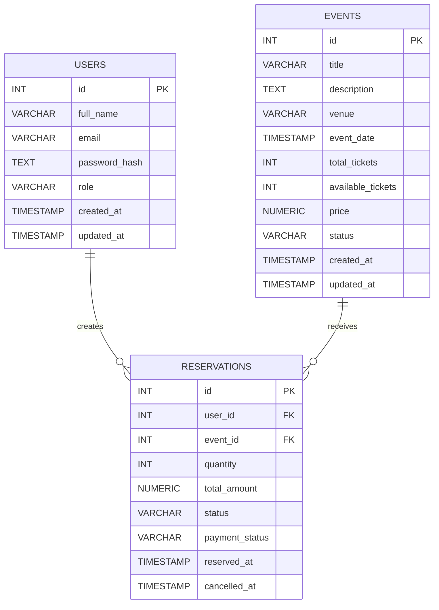

# Diagrama Editable de Base de Datos

## Notas de Diseno

- `users` almacena autenticacion inicial y roles base.
- `events` mantiene inventario para evitar sobreventa.
- `reservations` soporta confirmacion y cancelacion con devolucion simulada.
- La reserva debe ejecutarse dentro de transacciones con bloqueo de fila sobre `events`.
